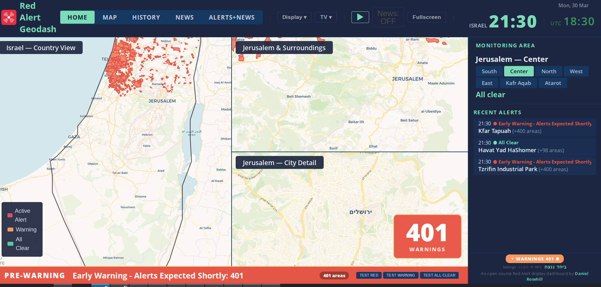

# Red Alert Monitoring Stack



Microservices stack for monitoring Israel's Homefront Command (Pikud HaOref) alerts with real-time visualization, push notifications, AI situation reports, and home automation integration.

## Architecture

Each component is a standalone service with its own repo, Docker config, and documentation. They communicate over HTTP and MQTT, sharing a single data source.

```
┌──────────────────────────────────────────────────────────────────────────┐
│                     Pikud HaOref (Homefront Command)                     │
│                     Geo-restricted alert API (Israel only)               │
└──────────────────────────────┬───────────────────────────────────────────┘
                               │ polled every 3s
                               ▼
                  ┌────────────────────────┐
                  │    Oref Alert Proxy    │
                  │    (FastAPI, :8764)    │
                  │    Single poller,      │
                  │    dumb relay          │
                  └───────────┬────────────┘
                              │
            ┌─────────────────┼─────────────────┐
            ▼                 ▼                  ▼
   ┌────────────────┐ ┌──────────────────┐ ┌────────────────┐
   │    Geodash     │ │ OSINT Notifier   │ │   Actuator     │
   │  (Dashboard)   │ │                  │ │  (HA Bridge)   │
   │                │ │  Telegram polls  │ │                │
   │  FastAPI +     │ │  Oref volumetric │ │  Sets state    │
   │  Leaflet maps  │ │  Groq intel      │ │  via HA REST   │──▶ Home Assistant
   │  + InfluxDB    │ │  Dual-model      │ │  API           │   (lights, sirens,
   │                │ │  sitrep          │ │                │    TTS, automations)
   │  :8083         │ │  RSS context     │ │  :8782         │
   │                │ │  → Pushover      │ │                │
   └────────────────┘ └──────────────────┘ └────────────────┘

            ┌──────────────┐   ┌──────────────┐
            │  RSS Cache   │   │  MCP Server  │
            │  (:8785)     │   │  (:8786)     │
            │              │   │  AI tools +  │
            │              │   │  stack health │
            └──────────────┘   └──────────────┘
```

## Components

| Service | Repository | Port | Description |
|---------|-----------|------|-------------|
| **Oref Alert Proxy** | [Oref-Alert-Proxy](https://github.com/danielrosehill/Oref-Alert-Proxy) | 8764 | Lightweight local relay that polls Pikud HaOref every 3 seconds and serves raw alert data via HTTP. Single source of truth. |
| **Geodash** | [Red-Alert-Geodash](https://github.com/danielrosehill/Red-Alert-Geodash) | 8083 | Real-time multi-map dashboard with 1,450 polygon overlays, InfluxDB time-series storage, historical playback, and TV-optimized view. |
| **OSINT Notifier** | [Red-Alert-OSINT-Notifier](https://github.com/danielrosehill/Red-Alert-OSINT-Notifier) | — | Unified notification and intelligence module. Monitors Telegram channels (EN/HE) for missile launches, Oref volumetric thresholds, Groq-powered intel reports, and dual-model OpenRouter sitreps — all via Pushover with RSS news context. |
| **Actuator** | *(this repo, `actuator/`)* | 8782 | HA bridge: polls proxy and sets `input_select` state in Home Assistant. HA automations handle lights, sirens, TTS. See `ha/` for examples. |
| **RSS Cache** | *(this repo, `rss-cache/`)* | 8785 | Polls news feeds on a schedule, serves cached articles. Used by Geodash dashboard. |
| **MCP Server** | *(this repo, `mcp-server/`)* | 8786 | Streamable HTTP MCP server exposing alert tools (`get_current_alerts`, `get_area_alerts`, `get_news`, etc.) for AI agents. Stores sample payloads every 3h. |
| **InfluxDB** | [influxdb](https://hub.docker.com/_/influxdb) | 8086 | Time-series database for alert history. |
| **Mosquitto** | [eclipse-mosquitto](https://hub.docker.com/_/eclipse-mosquitto) | 1883 | MQTT broker (bundled in `with-broker` compose, or bring your own). |

## Quick Start

### Prerequisites

- **Docker and Docker Compose** (v2+)
- **Israeli IP address** — the Oref Alert Proxy must run from within Israel (geo-restricted API)

### 1. Clone and configure

```bash
git clone --recurse-submodules https://github.com/danielrosehill/Red-Alert-Monitoring-Stack-Public.git
cd Red-Alert-Monitoring-Stack-Public
cp .env.example .env
```

Edit `.env` and fill in your values. See [Environment Variables](#environment-variables) below.

### 2. Choose your compose file

**Option A — You have an external MQTT broker** (e.g., Mosquitto already running on your LAN):

```bash
# Set MQTT_BROKER in .env to your broker IP (e.g., 10.0.0.4)
docker compose up -d
```

**Option B — You need a bundled MQTT broker:**

```bash
# Set MQTT_BROKER=mosquitto in .env
docker compose -f docker-compose.with-broker.yml up -d
```

### 3. Access the UIs

| UI | URL |
|----|-----|
| **Geodash Map** | http://localhost:8083 |
| **InfluxDB** | http://localhost:8086 |
| **MCP Server** | http://localhost:8786/mcp |
| **RSS Cache** | http://localhost:8785/api/news |

Stack health monitoring is available via the MCP server's `check_stack_health` tool — see [MCP Server](#mcp-server-ai-agent-integration) below.

## Environment Variables

All configuration is via `.env` (copy from `.env.example`). The file is gitignored.

### Required Variables

| Variable | Service | Description |
|----------|---------|-------------|
| `HASS_HOST` | Actuator | Home Assistant URL (e.g. `http://10.0.0.3:8123`) |
| `HASS_TOKEN` | Actuator | HA long-lived access token |
| `PUSHOVER_API_TOKEN` | OSINT Notifier | Your Pushover application token ([pushover.net](https://pushover.net/)) |
| `PUSHOVER_USER_KEY` | OSINT Notifier | Your Pushover user/group key |

### Optional Variables

| Variable | Default | Description |
|----------|---------|-------------|
| `OREF_PROXY_URL` | `http://oref-proxy:8764` | Override if proxy runs on a different host |
| `LOCATION_NAME` | `Jerusalem` | Your location for emergency-level alerts |
| `LOCAL_KEYWORDS_EN` | `jerusalem,central israel` | English keywords to detect local targeting |
| `LOCAL_KEYWORDS_HE` | `ירושלים,מרכז הארץ` | Hebrew keywords to detect local targeting |
| `INFLUXDB_ORG` | `redalert` | InfluxDB organization name |
| `INFLUXDB_BUCKET` | `alerts` | InfluxDB bucket name |
| `INFLUXDB_TOKEN` | `redalert-dev-token` | InfluxDB admin token |
| `OPENROUTER_API_KEY` | *(empty)* | OpenRouter key for dual-model sitrep generation |
| `GROQ_API_KEY` | *(empty)* | Groq key for fast immediate intelligence reports |
| `HASS_ENTITY` | `input_select.red_alert_state` | HA input_select entity ID |


## Building from Source

All services build from source in this monorepo — no external Docker Hub images are required (previous `danielrosehill/red-alert-*` images have been removed). The only upstream images used are `influxdb:2` and `eclipse-mosquitto:2`.

| Service | Source Directory |
|---------|-----------------|
| Oref Alert Proxy | `oref-proxy/` |
| Geodash | `geodash/` |
| OSINT Notifier | `osint-notifier/` (git submodule) |
| Actuator | `actuator/` |
| Prompt Runner | `prompt-runner/` |
| RSS Cache | `rss-cache/` |
| MCP Server | `mcp-server/` |

## MCP Server (AI Agent Integration)

The stack includes an MCP server that exposes alert data as tools for AI agents (Claude Code, Claude Desktop, etc.).

### Available Tools

| Tool | Description |
|------|-------------|
| `get_current_alerts` | All currently active alerts nationwide |
| `get_area_alerts` | Alerts within a radius of a lat/lon point |
| `get_alert_history` | Recent alert history including resolved alerts |
| `get_news` | Cached news articles from RSS feeds |
| `get_sample_payloads` | Stored sample alert payloads for development |
| `get_proxy_status` | Health check of the Oref Alert Proxy |
| `check_stack_health` | Ping all services and return stack-wide health summary |

### Connect from Claude Code

```bash
claude mcp add --transport http red-alert http://localhost:8786/mcp
```

### Connect from Claude Desktop

Add to your `claude_desktop_config.json`:

```json
{
  "mcpServers": {
    "red-alert": {
      "url": "http://localhost:8786/mcp"
    }
  }
}
```

### Sample Payload Storage

The MCP server automatically captures one real alert payload every 3 hours (when alerts are active) and stores it in a persistent volume. This builds a reference library of real payload structures for development. Access via the `get_sample_payloads` tool.

## Building Images

All services are built automatically by Docker Compose. To rebuild everything:

```bash
docker compose -f compose/default.yml build
```

To rebuild a single service:

```bash
docker compose -f compose/default.yml build geodash
```

## Actuation Pathways

The stack provides multiple independent pathways for physical alerting — mix and match based on your hardware:

- **Home Assistant (via Actuator)** — The actuator sets an `input_select` entity in HA via REST API. Your HA automations handle lights, sirens, TTS. See `config/ha/` for setup.
- **Home Assistant (via oref_alert)** — If you run [oref_alert](https://github.com/amitfin/oref_alert), use it for HA alerting and this stack as an orchestrator for everything else (map, AI reports, notifications, MCP).
- **Snapcast TTS (direct audio)** — Bypasses HA entirely. Streams PCM audio directly to Snapcast speaker groups for whole-house multi-room announcements.
- **Direct MQTT** — Publish to Mosquitto topics for MQTT-native devices (Zigbee2MQTT lights, ESP32 controllers, Node-RED flows).
- **Custom consumers** — Poll the proxy's HTTP API (`GET /api/alerts`) from anything.

For full details on architecture and choosing an actuation path, see **[docs/ARCHITECTURE.md](docs/ARCHITECTURE.md)**.

## Design Principles

- **Microservices** — Each service does one thing. The proxy polls, the dashboard visualizes, the OSINT notifier handles all intelligence and push notifications, the actuator controls physical devices.
- **Single data source** — One proxy, one connection to Pikud HaOref. No redundant polling.
- **Dumb relay** — The proxy passes through raw data with no interpretation. Each consumer applies its own logic.
- **Adapt, don't prescribe** — Multiple actuation pathways because everyone's home setup is different.
- **No secrets in code** — Everything configured via `.env` files, which are gitignored.
- **Graceful degradation** — Each service runs independently. If one goes down, the rest keep working.
- **No external image dependencies** — All services build from source in this monorepo.

## Alert Flow Example

When a rocket barrage triggers 150+ simultaneous alerts:

1. **Proxy** picks it up within 3 seconds, serves via `/api/alerts`
2. **Geodash** colors 150 polygons red on the map, writes to InfluxDB
3. **OSINT Notifier** sends "150 areas under active alert" via Pushover (lowest priority, informational)
4. **Actuator** sets HA state to `threshold_150`, HA automations announce via TTS

When your local area (e.g., Jerusalem) is targeted by a ballistic missile:

1. **OSINT Notifier** detects the launch via Telegram channel monitors (EN + HE keyword classifiers)
2. High-priority (P1) Pushover alert fires — bypasses quiet hours
3. **Groq intel report** follows within ~5s — origin, munitions, scale
4. **Dual-model sitrep** follows within ~15-30s — Gemini 3 Flash + Grok 4.1 Fast synthesized into authoritative briefing, with live RSS news context
5. **Actuator** sets HA state to `active`, HA automations flash lights red, sound sirens, TTS "Seek shelter"
6. **Geodash** shows your area flashing red with siren audio
7. When all-clear arrives: actuator sets `clear`, HA automations turn lights green, silence sirens, TTS "All clear"

## Related

- [Awesome-Red-Alerts](https://github.com/danielrosehill/Awesome-Red-Alerts) — Curated list of Pikud HaOref API wrappers and alert projects
- [Miklat-MCP](https://github.com/danielrosehill/Miklat-MCP) — MCP server for finding nearby bomb shelters (miklatim)
- [HFC-Guidance-Flip-Book](https://github.com/danielrosehill/HFC-Guidance-Flip-Book) — Homefront Command guidance as a digital flip book
- [Pikud-Haoref-Guidelines-0326](https://github.com/danielrosehill/Pikud-Haoref-Guidelines-0326) — Pikud HaOref guidelines archive (March 2026)
- [HA-Red-Alerts-Model-Automations](https://github.com/danielrosehill/HA-Red-Alerts-Model-Automations) — Model Home Assistant automations for red alert responses
- [Red-Alert-MQTT-Desktop-Notifier-Public](https://github.com/danielrosehill/Red-Alert-MQTT-Desktop-Notifier-Public) — MQTT-based desktop notification client for red alerts
- [Geopol-Forecaster-POC](https://github.com/danielrosehill/Geopol-Forecaster-POC) — Geopolitical forecasting proof of concept

## License

MIT

## Author

Daniel Rosehill ([danielrosehill.com](https://danielrosehill.com))
